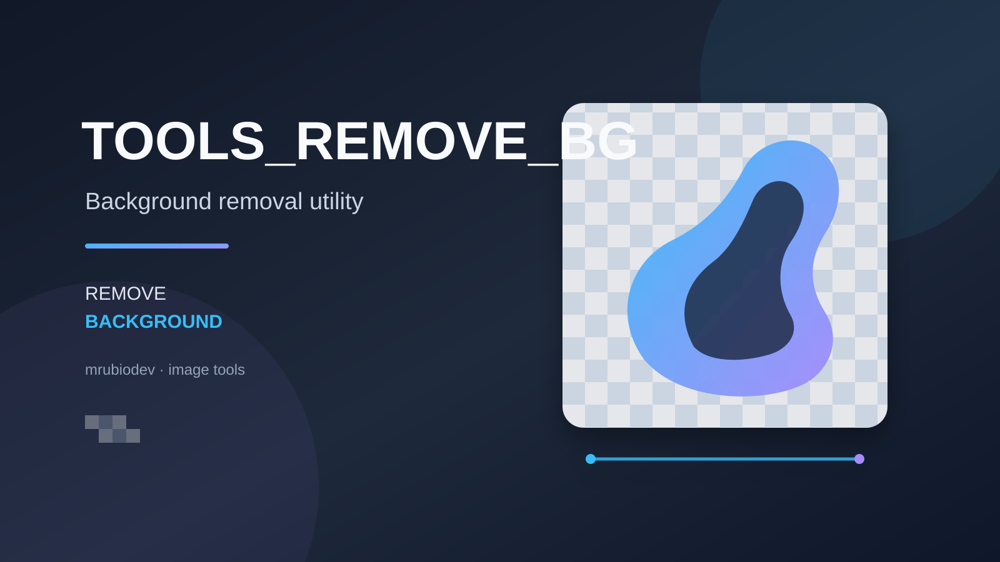

# Tools_remove_bg



Herramienta de escritorio y línea de comandos para quitar el fondo de imágenes con [rembg](https://github.com/danielgatis/rembg). Guarda el resultado en PNG con transparencia o, si lo indicas, sobre un color sólido.

## Funciones

- Interfaz gráfica para elegir archivos o carpetas.
- Procesamiento desde la terminal de una imagen o de las imágenes de una carpeta.
- Modelos de segmentación seleccionables; se usa `u2net` por defecto.
- Opción de alpha matting para refinar bordes complejos.
- Fondo transparente por defecto o color hexadecimal opcional.

## Requisitos

- Python 3.10 o posterior.
- Windows, macOS o Linux para el uso por terminal. La interfaz gráfica requiere que Python incluya Tkinter.
- Conexión a Internet la primera vez que se usa un modelo, para descargar sus archivos.

## Instalación

Desde la carpeta del repositorio, crea y activa un entorno virtual e instala las dependencias:

**Windows (PowerShell):**

```powershell
py -3 -m venv .venv
.\.venv\Scripts\Activate.ps1
python -m pip install --upgrade pip
pip install -r requirements.txt
```

**macOS o Linux:**

```bash
python3 -m venv .venv
source .venv/bin/activate
python -m pip install --upgrade pip
pip install -r requirements.txt
```

## Uso

### Interfaz gráfica

Con el entorno virtual activo, ejecuta el programa sin argumentos:

```bash
python remove_bg.py
```

Selecciona una imagen o carpeta, ajusta el modelo y las opciones, y pulsa **Procesar**.

### Una imagen

```bash
python remove_bg.py foto.jpg
```

El resultado se guarda junto a la imagen como `foto_nobg.png`. Para elegir otra ruta:

```bash
python remove_bg.py foto.jpg -o salida/foto_sin_fondo.png
```

### Varias imágenes de una carpeta

```bash
python remove_bg.py ./imagenes/ -o ./salida/
```

Se procesan las imágenes compatibles que están directamente dentro de la carpeta (no se buscan en subcarpetas). Cada resultado se guarda como PNG con el sufijo `_nobg`. Si omites `-o`, se crea una carpeta `nobg` dentro de la carpeta de entrada.

Formatos de entrada: JPG/JPEG, PNG, WebP, BMP y TIFF.

### Opciones frecuentes

```bash
# Elegir un modelo
python remove_bg.py foto.jpg --model u2netp

# Aplicar un fondo blanco en lugar de transparencia
python remove_bg.py foto.jpg --bg-color "#FFFFFF"

# Refinar los bordes con alpha matting
python remove_bg.py foto.jpg --alpha-matting
```

Modelos disponibles: `u2net` (predeterminado), `u2netp`, `u2net_human_seg`, `u2net_cloth_seg`, `silueta`, `isnet-general-use`, `isnet-anime` y `birefnet-general`. Algunos requieren más memoria o tardan más.

Para consultar todas las opciones:

```bash
python remove_bg.py --help
```

## Archivos principales

- `remove_bg.py`: interfaz gráfica y procesamiento por terminal.
- `requirements.txt`: dependencias de Python.
- `docs/imagenes/portada.svg`: imagen de portada del repositorio.

Los archivos `.bat` presentes son auxiliares heredados y algunos hacen referencia a módulos y recursos que no están en el repositorio (`ScraptTools.py`, `main.py`, `res`). No son necesarios para los pasos de instalación y uso anteriores.

## Repositorio

[github.com/mrubiodev/Tools_remove_bg](https://github.com/mrubiodev/Tools_remove_bg)
